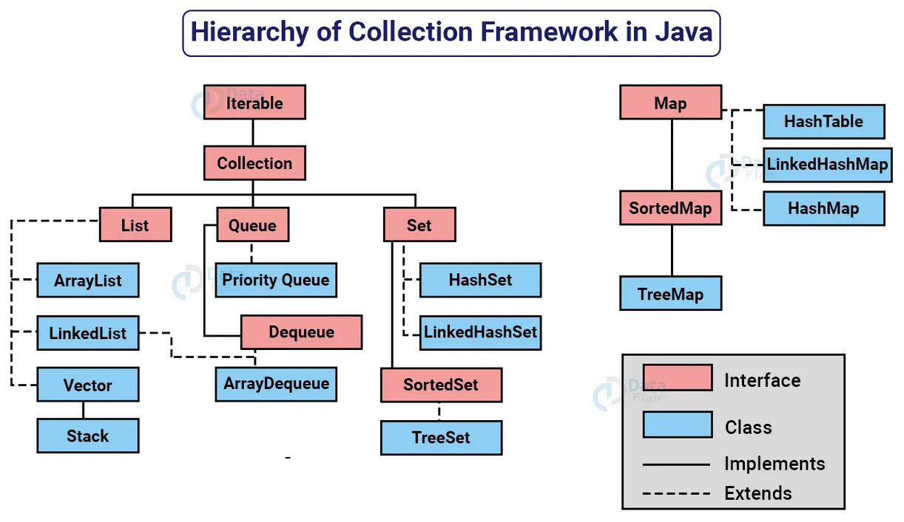

## Collection Framework API

<ul>
    <li>Uma coleção (collection) é uma estrutura de dados que serve para agrupar muitos elementos em uma única unidade, estes elementos precisão ser Objetos.</li>
    <li>Uma Collection pode ter coleções homogêneas e heterogêneas, normalmente utilizamos coleções homogêneas de um tipo especifico.</li>
    <li>O núcleo principal das coleções é formado pelas interfaces da figura a abaixo, essas interfaces permitem manipular a coleção independente do nível de detalhe que elas representam.</li>
    <li>Temos quatro grandes tipos de coleções: List (lista), Set (conjunto), Queue (fila) e Map (mapa), a partir dessas interfaces, temos muitas subclasses concretas que implementam varias formas diferentes de se trabalhar com cada coleção.</li>
</ul>
 

